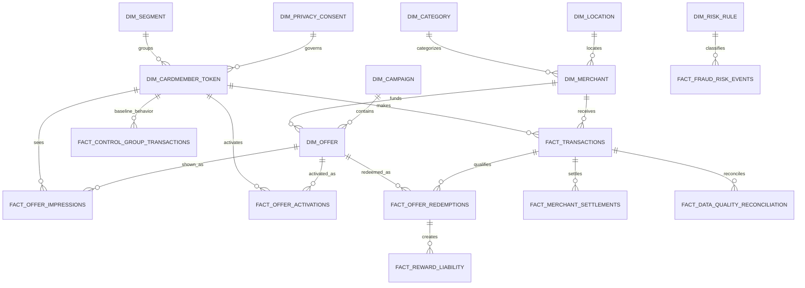

# Initial ERD

## Purpose

This document defines the initial entity relationship design for MerchantLift BI.

This is a starting point. The final ERD will evolve during data model design.

---

TODO: This is painful. Need to move to excalidraw

## 1. Core Entity Relationships

```text
dim_cardmember_token
        │
        ├── fact_offer_impressions
        │
        ├── fact_offer_activations
        │
        ├── fact_transactions
        │
        └── fact_control_group_transactions


dim_merchant
        │
        ├── dim_offer
        │
        ├── fact_transactions
        │
        ├── fact_offer_redemptions
        │
        ├── fact_reward_liability
        │
        ├── fact_merchant_settlements
        │
        ├── fact_fraud_risk_events
        │
        └── fact_data_quality_reconciliation


dim_campaign
        │
        └── dim_offer
                │
                ├── fact_offer_impressions
                ├── fact_offer_activations
                ├── fact_offer_redemptions
                └── fact_reward_liability


dim_segment
        │
        ├── dim_cardmember_token
        ├── fact_offer_impressions
        ├── fact_offer_activations
        ├── fact_control_group_transactions
        └── mart_privacy_safe_offer_lift


dim_category
        │
        └── dim_merchant


dim_location
        │
        ├── dim_merchant
        └── dim_cardmember_token


dim_privacy_consent
        │
        └── dim_cardmember_token


dim_risk_rule
        │
        └── fact_fraud_risk_events
```

---

## 2. Important Join Paths

### Offer Exposure Path

```text
dim_cardmember_token
    → fact_offer_impressions
    → dim_offer
    → dim_campaign
    → dim_merchant
```

Meaning:

> Which cardmembers saw which offers from which merchants?

---

### Offer Activation Path

```text
dim_cardmember_token
    → fact_offer_activations
    → dim_offer
```

Meaning:

> Which cardmembers expressed intent by activating an offer?

---

### Transaction Path

```text
dim_cardmember_token
    → fact_transactions
    → dim_merchant
```

Meaning:

> Which tokenized cardmembers transacted at which merchants?

---

### Redemption Matching Path

```text
fact_offer_activations
    + fact_transactions
    + dim_offer
    → fact_offer_redemptions
```

Meaning:

> Which transactions qualified for activated offers?

---

### Reward Liability Path

```text
fact_offer_redemptions
    → fact_reward_liability
```

Meaning:

> Which redemptions created reward cost?

---

### Incrementality Path

```text
fact_transactions
    + fact_control_group_transactions
    + fact_offer_redemptions
    → mart_offer_incrementality
```

Meaning:

> Did test-group behavior exceed control-group baseline behavior?

---

### Reconciliation Path

```text
fact_transactions
    + fact_reward_liability
    + fact_merchant_settlements
    → fact_data_quality_reconciliation
```

Meaning:

> Do transaction, reward, fee, and settlement amounts tie out?

---

### Privacy-Safe Reporting Path

```text
mart_offer_incrementality
    + mart_merchant_economics
    + privacy threshold rules
    → mart_privacy_safe_offer_lift
```

Meaning:

> Can merchant teams analyze offer lift without seeing customer-level behavior?

---

## 3. Mermaid ERD Draft



---

## 4. Summary

The initial ERD shows how MerchantLift BI connects:

- customers
- merchants
- campaigns
- offers
- impressions
- activations
- transactions
- redemptions
- rewards
- settlements
- fraud events
- reconciliation checks
- privacy-safe marts

The most important relationship is:

```text
activation + transaction + offer rules → redemption
```

The most important analytics relationship is:

```text
test behavior vs control behavior → incrementality
```

The most important privacy relationship is:

```text
customer-level data → aggregated privacy-safe cohorts
```